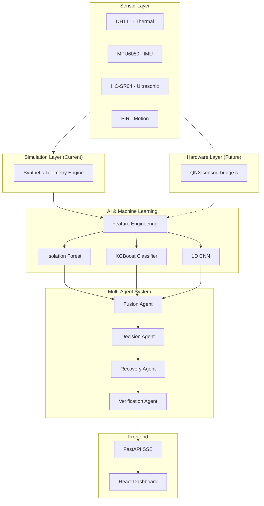

# RAVEN
## Real-time Autonomous Vehicle Environment Network

---

## 1. Project Overview
RAVEN is a robust, multi-agent-architected fault detection and recovery platform designed for autonomous vehicles and robotics. It integrates multi-variate sensor fusion, machine learning, and temporal deep learning to detect, classify, and mitigate hardware anomalies in real time.

## 2. Problem Statement
Autonomous edge vehicles operate in volatile environments where physical shock, thermal limits, and sensor degradation pose constant threats. Traditional threshold-based monitoring fails to detect complex, interacting failures or transient anomalies, often leading to catastrophic failure or unsafe operation before intervention can occur.

## 3. Motivation
To ensure the safety and reliability of mission-critical robotic systems, a layered, intelligent approach is required. RAVEN seeks to bridge the gap between raw hardware telemetry and actionable software-level recovery through a highly decoupled, multi-agent AI framework capable of edge execution.

## 4. Key Features
- **Multi-Model AI Fusion:** Combines Unsupervised (Isolation Forest), Supervised Tabular (XGBoost), and Deep Temporal (1D CNN) models.
- **Agent-Based Architecture:** Specialized agents for Fusion, Decision, Recovery, and Verification.
- **Hardware-Agnostic Abstraction:** Clean `SensorInterface` allows seamless swapping between simulation engines and physical hardware drivers.
- **Real-Time Dashboard:** Interactive React UI tracking live telemetry and multi-agent confidence.

## 5. System Architecture

*(Note: Dotted lines represent future hardware integration paths versus current simulation paths).*

## 6. Sensor Architecture
- **DHT11:** Temperature and Humidity monitoring (I2C/GPIO).
- **MPU6050:** 6-DoF Accelerometer and Gyroscope (I2C).
- **HC-SR04:** Ultrasonic proximity (GPIO).
- **PIR:** Motion detection (GPIO).

## 7. AI/ML Architecture
- **Feature Engineering:** Extracts 13 invariant features from 50Hz windows (128 samples).
- **Isolation Forest:** Unsupervised novelty detection to flag unknown anomalies using empirical 1st percentile thresholds.
- **XGBoost Classifier:** Supervised tabular classification evaluating the 13 static features (handles missing data naturally).
- **1D CNN (ONNX):** Deep temporal classification acting directly on the raw waveforms to catch transient shapes.

## 8. Multi-Agent Architecture
The system employs an asynchronous message bus enabling distinct agents to communicate:
- **Fusion Agent:** Employs rule-based logic to resolve conflicts between the three AI models.
- **Decision Agent:** Maps the fused state (NORMAL, SUSPICIOUS, WARNING, CRITICAL) to specific mitigation actions.
- **Recovery Agent:** Dispatches software-level recovery commands (e.g., "Throttle Limit", "Reset Sensor").
- **Verification Agent:** Evaluates post-recovery telemetry to confirm resolution.

## 9. Dashboard
The RAVEN frontend is a React 19 application utilizing Tailwind CSS and Recharts. It connects to the Python backend via Server-Sent Events (SSE) to display a real-time, 60fps view of the sensor time-series data, AI probability distributions, and the agent decision pipeline.

## 10. Simulation Mode
**Current Environment:** The platform runs via the `SyntheticTelemetryEngine`. This engine generates 50Hz multivariate physics-based simulations of the sensors undergoing 8 distinct fault scenarios. It allows complete end-to-end testing of the AI and UI without physical hardware.

## 11. QNX Architecture
**Deployment Target:** The platform is designed for cross-compilation to the QNX Neutrino RTOS 8.0. The `qnx/` directory contains C source stubs (`sensor_bridge.c`) and a `Makefile` ready for integration with the QNX SDP AArch64 toolchain.

## 12. Raspberry Pi Deployment Plan
The target edge device is a Raspberry Pi 4 (4GB). 
- **Phase 1:** Flash QNX SDP 8.0.
- **Phase 2:** Implement I2C/SPI physical interactions in C.
- **Phase 3:** Bridge QNX C binaries to the Python multi-agent layer via IPC (Unix Sockets).
- **Phase 4:** Perform edge-inference profiling on the `.onnx` models.

## 13. Wireless Telemetry Architecture
**Future Target:** The FastAPI backend is designed to serve the SSE stream over an ad-hoc Wi-Fi network hosted by the Raspberry Pi, allowing the Dashboard to run on a remote command laptop while the vehicle is in motion. Currently, it streams over localhost.

## 14. Dataset Strategy
- **Synthetic Data (Primary):** The project relies on locally generated synthetic data representing the 8 specific RAVEN scenarios.
- **UCI HAR (Auxiliary):** The UCI Human Activity Recognition dataset was used strictly for early architectural exploration of the 1D CNN. It is not distributed with this repository.

## 15. Installation
See `QUICKSTART.md` for complete environment setup instructions.
Required: Python 3.10+, Node.js v22+.

## 16. Configuration
Paths and settings are managed dynamically. No hardcoded absolute paths exist. See `.env.example` for optional environment overrides (e.g., `RAVEN_UCI_HAR_PATH`).

## 17. Running the Simulator
Generate the required telemetry data:
```powershell
.\scripts\generate_all.ps1
```

## 18. Running the AI Pipeline
Train the models:
```powershell
.\scripts\train_all.ps1
```

## 19. Running the Dashboard
Launch the FastAPI backend and React frontend:
```powershell
python api/server.py
cd dashboard && npm run dev
```

## 20. Running Tests
Run the comprehensive `pytest` suite:
```powershell
.\scripts\test_host.ps1
```

## 21. Project Structure
```text
RAVEN/
├── agents/         # Multi-agent system logic
├── ai/             # ML feature engineering and model classes
├── api/            # FastAPI backend adapter
├── config/         # Path configurations
├── dashboard/      # React Vite frontend
├── data/           # Ignored directory for datasets
├── docs/           # Internal documentation
├── logs/           # Application run logs
├── models/         # Compiled .onnx, .json, .joblib weights
├── qnx/            # QNX C source stubs and Makefiles
├── scripts/        # PowerShell and Python runner scripts
├── simulation/     # Synthetic telemetry engine
└── tests/          # Pytest unit and integration tests
```

## 22. Current Status
**Host Simulation Complete.** The AI models, multi-agent pipeline, and frontend dashboard are fully functional on Windows x86_64 utilizing synthetic telemetry. See `PROJECT_STATUS.md`.

## 23. Hardware Requirements
- **Host (Current):** Windows 10/11, Python 3.10, Node.js v22+.
- **Edge (Future):** Raspberry Pi 4 (4GB), DHT11, MPU6050, HC-SR04, PIR sensors.

## 24. Future Work
- Physical deployment to Raspberry Pi 4.
- I2C and GPIO driver integration in QNX.
- Re-tuning AI threshold parameters based on physical sensor noise profiles.
- Measuring true ONNX inference latency on the AArch64 edge processor.

## 25. Limitations
- **Simulation Disclaimer:** The system currently runs in a simulated environment. 99% accuracy claims apply strictly to the synthetic test splits and do not represent real-world physical accuracy.
- **Software Recovery:** Recovery actions (e.g., "Throttle Limit") are simulated software dispatches. Physical actuator response has not yet been integrated.

## 26. License
This project is licensed under the MIT License - see the `LICENSE` file for details.

## 27. Third-Party Acknowledgements
This project utilizes several open-source technologies, including scikit-learn, XGBoost, PyTorch, React, Vite, and the UCI HAR Dataset (for architecture exploration). 
See `THIRD_PARTY_NOTICES.md` for full attribution and licensing details.
